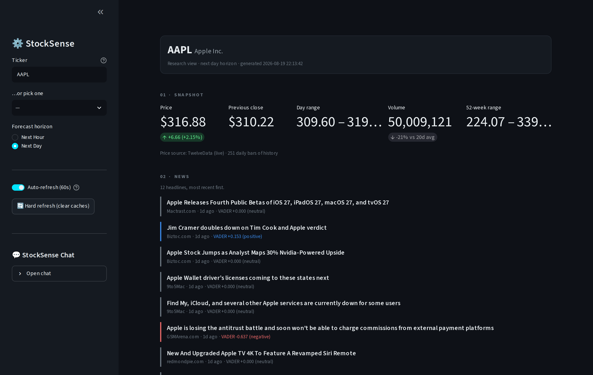
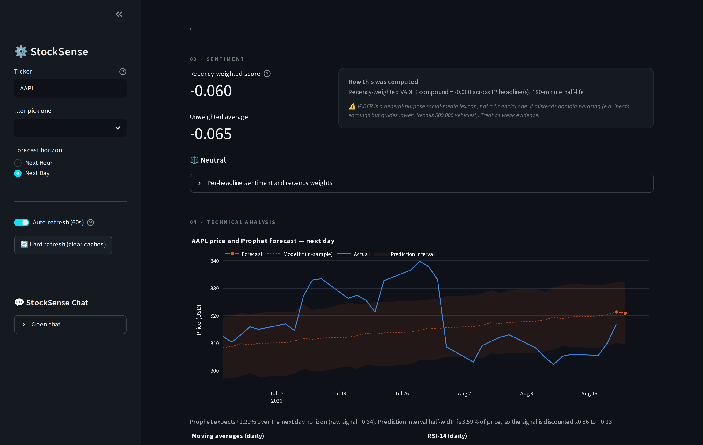
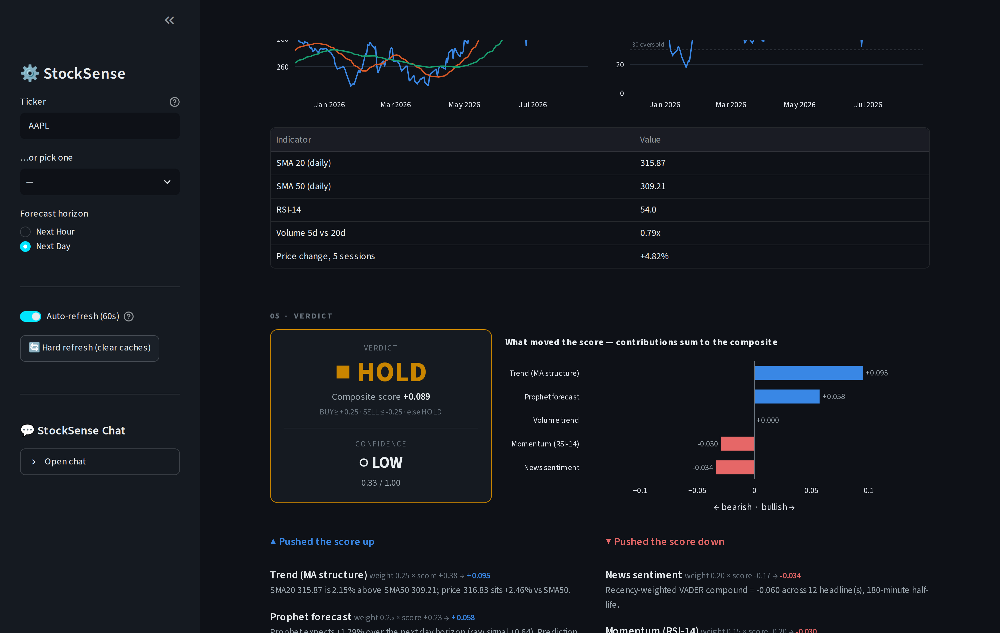

# 📊 StockSense

**StockSense is a single-page equity research dashboard built with Streamlit.**
You type in a ticker and it pulls together everything in one continuous flow: a
live price snapshot, recent news with sentiment scoring, a Prophet price
forecast, classic technical indicators, and a composite **BUY / HOLD / SELL**
verdict with a confidence rating. The point of the project is that the verdict
shows its own arithmetic — every signal that moved the score is listed with its
weight, its value, and the raw numbers it came from.

> ⚠️ **This is a learning project. It produces automated analysis, not financial
> advice.** The verdict has **not been backtested** — nothing here demonstrates
> that these signals predict returns. Do not trade on it. See
> [Disclaimer](#️-disclaimer).

---

## 🔗 Live demo

Not deployed yet — coming soon.

<!-- After deploying, replace the line above with:
     **▶️ [Try StockSense live](https://YOUR-APP-NAME.streamlit.app)** -->

To deploy it yourself, push this repo to GitHub, go to
[share.streamlit.io](https://share.streamlit.io), point it at
`StockSense-main/app.py`, and add your API keys under **Settings → Secrets**.

> **Heads-up on deploying:** NewsAPI's free plan only serves requests from
> `localhost`, so a deployed copy will return no headlines. The app handles this
> gracefully — the news and sentiment sections say so, the sentiment signal is
> marked unavailable, and the verdict's confidence drops instead of quietly
> pretending the data was there. Everything else works fine.

---

## 📸 Screenshots

**Snapshot and news feed** — live price, day change, volume vs its 20-day
average, and headlines with their sentiment scores:



**Sentiment, Prophet forecast and technicals** — the forecast is drawn with its
prediction interval, and the caption states exactly how much that uncertainty
discounted the signal:



**The verdict** — the call, its confidence, and a chart of what moved the score:



---

## ✨ Features

| Section | What you get |
|---|---|
| **01 · Snapshot** | Last price, day change, previous close, day range, volume vs its 20-day average, and the 52-week range. Price comes from yfinance, overlaid with a live TwelveData quote when a key is configured. |
| **02 · News** | Up to 12 headlines, most recent first, each with its source, its age, and its VADER sentiment score. Only headline matches are used — an article that merely mentions the company in its body tells you nothing about the stock. |
| **03 · Sentiment** | A recency-weighted sentiment score (newer headlines count more, on a 180-minute half-life), the plain unweighted average next to it, and a per-headline breakdown showing each article's decay weight. |
| **04 · Technical analysis** | A Prophet forecast plotted with its prediction interval, plus SMA-20 / SMA-50 moving averages, RSI-14, and a volume trend — all computed on daily bars. |
| **05 · Verdict** | BUY / HOLD / SELL, a confidence rating, and a horizontal bar chart of each signal's contribution. Below it, every signal is listed with the arithmetic that produced it, and any conflict between signals is called out explicitly. |
| **Appendices** | Compare up to 3 tickers on a 30-day normalised chart, and an optional Gemini chat/narration panel that explains the numbers in plain English. |

**Forecast horizon** is switchable in the sidebar. *Next Hour* fits Prophet on
30-minute intraday bars; *Next Day* fits on the daily close series.

---

## 🧮 How the verdict is calculated

The app reads five different things about the stock. Each one is boiled down to
a single score between **−1** (as bearish as it gets) and **+1** (as bullish as
it gets). Each score gets a fixed weight — how much of a vote it has — and the
verdict is the weighted average.

| Signal | Weight | In plain English |
|---|:---:|---|
| **Trend** | 25% | Is the 20-day average above the 50-day average, and is the price above that base? Short average above long average = uptrend = bullish. |
| **Prophet forecast** | 25% | Prophet predicts the next price. A predicted rise is bullish. **But if its prediction interval is wide** — i.e. the model isn't sure — the signal is shrunk toward zero automatically. An uncertain forecast gets a quieter vote. |
| **News sentiment** | 20% | VADER scores each headline as positive or negative; recent headlines count more. Fewer than 3 articles and the signal is damped, because a single headline isn't a mood. |
| **Momentum (RSI-14)** | 15% | Read as **mean reversion**: an overbought stock (RSI 70) scores bearish, an oversold one (RSI 30) scores bullish. |
| **Volume trend** | 15% | Volume has no direction of its own, so it's used as *confirmation*: heavy volume on a rising price is bullish, heavy volume on a falling price is bearish, and ordinary volume votes ≈ 0. |

### Turning five scores into one call

Multiply each score by its weight, add them up, and divide by the total weight
of the signals that actually had data. That number is the **composite score**,
between −1 and +1:

- **+0.25 or higher → BUY**
- **−0.25 or lower → SELL**
- **anything in between → HOLD**

Because of how the maths works out, the bars in the contribution chart add up
*exactly* to the composite score. The chart isn't an illustration of the
verdict — it **is** the verdict, drawn.

If a signal has no data (no news, or not enough price history), it isn't
counted as a neutral vote. The remaining signals are re-weighted among
themselves, and the *confidence* takes the hit instead — so missing data can
never silently drag the call toward HOLD.

### What confidence means

Confidence is a 0–1 rating built from three questions:

1. **Coverage** — how many of the five signals actually had data?
2. **Agreement** — do the signals point the same way, or are they arguing?
3. **Magnitude** — is the composite a decisive number, or barely off zero?
   (Everyone agreeing on "meh" is not a confident call.)

The result is banded **LOW** (< 0.40), **MODERATE** (< 0.70) or **HIGH**, with
hard caps that the app shows you along with the reason: it can't exceed
MODERATE on fewer than 3 headlines or fewer than 60 days of price history, and
it's capped to LOW if under half the signal weight had data.

When the strongest bullish and strongest bearish signals are *both* strong, the
page prints an explicit **"signals conflict"** note naming both sides, rather
than presenting a middling average as if it were a consensus.

The full methodology — every formula, saturation constant and known weakness —
is in **[docs/METHODOLOGY.md](docs/METHODOLOGY.md)**. All of it lives in one
pure Python file, `StockSense-main/analysis.py`: no network calls, no UI code,
no LLM. Run `python test_analysis.py` to check the arithmetic yourself.

---

## 🛠️ Tech stack

| Layer | Tools |
|---|---|
| **UI** | Streamlit, `streamlit-autorefresh`, Plotly (dark theme) |
| **Data** | yfinance (prices, quotes, company names), TwelveData (live price), NewsAPI (headlines) |
| **Analysis** | pandas, NumPy, Prophet (forecasting), VADER (`vaderSentiment`) |
| **LLM (optional)** | Google Gemini via `google-generativeai` — narration and chat only; **it never touches a score** |
| **Language** | Python 3.9+ |

---

## 🚀 Setup

```bash
# 1 · Clone the repo
git clone https://github.com/AnindaSaprotivRoy/Stocksense.git
cd Stocksense/StockSense-main

# 2 · Create a virtual environment
python -m venv venv
source venv/bin/activate        # Windows: venv\Scripts\activate

# 3 · Install dependencies
pip install -r requirements.txt
```

### API keys

Create a file called `.env` inside `StockSense-main/` (the same folder as
`app.py`) with these three lines. **Use your own keys — never commit this file;
it's already in `.gitignore`.**

```env
NEWS_API_KEY=your_newsapi_key_here
GOOGLE_API_KEY=your_gemini_key_here
LIVE_API_KEY=your_twelvedata_key_here
```

| Variable | Where to get it | What you lose without it |
|---|---|---|
| `NEWS_API_KEY` | [newsapi.org/register](https://newsapi.org/register) — free | No headlines, so the news and sentiment sections are empty and the sentiment signal is excluded (confidence drops) |
| `GOOGLE_API_KEY` | [aistudio.google.com/app/apikey](https://aistudio.google.com/app/apikey) — free tier | No plain-English narration and no chat. Scores are unaffected. |
| `LIVE_API_KEY` | [twelvedata.com/pricing](https://twelvedata.com/pricing) — free tier | No live price overlay; the price falls back to yfinance |

**None of the keys are required to run the app.** A missing key degrades that
one section and lowers the verdict's confidence — it never breaks the page.

### Run it

```bash
streamlit run app.py        # opens http://localhost:8501
python test_analysis.py     # self-tests for the scoring methodology
```

---

## 📉 Free-tier limits

These are the real constraints of the free plans this project is built on:

- **TwelveData — 800 API calls/day** (and 8/minute). The live price is fetched
  on each snapshot refresh, so leaving auto-refresh (60s) on all day will burn
  through it. Toggle it off in the sidebar when you don't need it.
- **NewsAPI — 100 requests/day**, and the free "Developer" plan **only accepts
  requests from `localhost`**. It works while you're developing; a deployed
  copy gets no news. Headlines are cached for 10 minutes to stay under the cap.
- **Gemini** free tier has its own per-minute request limits, which is why
  narration is behind a button rather than generated automatically.

To keep usage low, the app caches everything: quotes 30s, news 10 min, daily
prices 15 min, the Prophet fit 15 min, and company names 24 h. Auto-refresh
only refreshes the snapshot — it deliberately does *not* refit the forecast.

---

## 📁 Project structure

```
Stocksense/
├── README.md                  ← you are here
├── docs/
│   ├── METHODOLOGY.md         full scoring methodology and known weaknesses
│   └── screenshot-*.png
└── StockSense-main/
    ├── app.py                 Streamlit UI and page flow (fetches and renders)
    ├── analysis.py            the methodology — indicators, signals, verdict (pure functions)
    ├── test_analysis.py       self-tests pinning the scoring guarantees
    ├── fetch_data.py          yfinance prices/quotes, NewsAPI headlines
    ├── realtime_data.py       TwelveData live price
    ├── sentiment_model.py     VADER scoring of headlines
    ├── signals.py             recency-decay weighting
    ├── gemini_client.py       Gemini access (narration and chat only)
    └── requirements.txt
```

---

## ⚠️ Disclaimer

**StockSense is a personal learning project. It is not financial advice, and it
is not a trading tool.**

The BUY / HOLD / SELL verdict is an automated weighted average of five
technical and sentiment indicators. Specifically:

- **It has never been backtested.** There is no evidence — none — that these
  signals or these weights predict future returns. The weights were chosen by
  judgement, not by optimisation against historical data.
- **The sentiment model is the wrong tool for finance.** VADER is a
  general-purpose social-media lexicon; it reads "beats earnings but guides
  lower" as roughly neutral. That's why sentiment carries a low weight.
- **Prophet is being used outside its design envelope.** It's built for
  daily/weekly series with real seasonality, not short-horizon price
  prediction. On this data it largely extrapolates recent drift.
- **News coverage is thin and English-only**, and market data may be delayed.

Everything here is for educational and informational purposes. Do your own
research and talk to a qualified financial adviser before making any investment
decision. The author accepts no liability for any loss arising from use of this
software.
